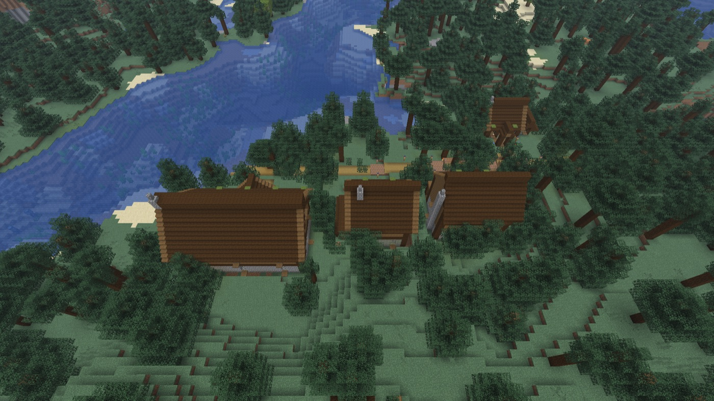

# Steward

**A Claude-driven NPC steward that designs, builds and evolves a settlement in your Minecraft world from what you describe.**
A village, a castle, a rift settlement, a "repurposed meteor crater mining facility, hellish evil lair": you describe it, approve a concept card, and the steward designs a style bible,
the buildings and their layout, then places them, keeps them up to date as you progress, and asks you before it spends or demolishes anything.

> **Status: early development, not playable yet.** The pipeline now works end to end from the dev console: one sentence produced a concept card, a style bible, four designed buildings and a placed
> street, in a forest with trees on every lot. There is no Founding Stone, steward NPC or in-game UI yet, so nothing here is ready to install. See [Status](#status).



*Dev-console run: "a small mossy forest village of spruce and stone" (tavern, house, shop, cottage; about $12 of Claude usage). Not a player-facing flow yet.*

Steward is a **sibling mod to [Architect](https://github.com/larattalabs/architect-mc)** (Fabric, Minecraft 26.3), which provides the building generator, library, placement, survival construction and the
region engine. Steward adds the director on top: concept card, layout, a persistent steward, permission levels, difficulty modes, and the evolve-over-time loop. Like Architect, it is singleplayer
only and runs Claude through Architect's local helper (Claude Agent SDK): bring an Anthropic API key, or, for personal use only, your own local `claude` login.

## How it works

```
your words -> concept card (site / style / purpose / story / constraints) -> you approve
           -> survey + village layout -> style bible (one look for the whole settlement)
           -> massing for every building (cheap shapes you approve or redirect)
           -> detailed designs in parallel (Opus for landmarks, Sonnet for the rest) + a short report critique each
           -> fit each building to its lot, place in stages (landmarks first), roads, one undo for the lot
           -> later: Architect delta updates ("update available"), kept player edits, survival construction with a bill of materials
```

- **Generative first.** Claude does the design work from your prompt; bundled programs are inspiration and a free fallback, never the point.
- **You stay in control.** Permission levels (Observer, Proposals, Autonomous, Full) decide what the steward may do without asking. Spending past 80% of the budget always asks.
- **Everything is undoable and logged.** Placement goes through Architect's journal, so Remove restores the terrain exactly, in any order.
- **Honest about cost.** Measured figures, not guesses: a style bible about $1.2-2, a landmark building $2-3.2, an ordinary building $0.8-2.5, a settlement of 8-20 buildings roughly $12-50 and 30-90 minutes.
  A report critique adds $0.05-0.15 per building. (On a claude login these are notional plan usage, not dollars.)

## Status

Built and tested offline (87 unit tests, CI green on GitHub Actions):
concept card schema and parser prompt; settlement store and claims; village layout; lot-to-design-request; the design-group, placement-batch and update planners; the budget policy; and the whole
generation pipeline as a pure state machine.

Run for real (dev client, claude login):
- the concept card (about 2 cents, 6 seconds);
- a full settlement flow, dev console only: card, survey of a dense forest (tree trunks read as ground), layout, style bible, 4 designs with massings, fit to lots, placement with a road. It found and fixed real
  bugs (lots too small for their approach, duplicate approvals, a batch group id, temporary refusals). Still rough: buildings sit close, the street is a plain path, no persistence across restarts.

Founding Stone (a right-click claims a 129x129 area, saved per world, overlapping claims refused) with `/steward describe`, `/steward start` and `/steward settlements`.

The steward NPC appears when you claim land: a persistent, player-shaped citizen (vanilla's mannequin entity, tagged with its settlement) that right-click reports on its settlement.

Until the inbox exists, the build's decisions are commands: `/steward approve`, `redirect`, `raise` and `cancel` (the steward tells you which one it is waiting for).

Not built yet: steward movement and a custom skin, the concept-card screen, the inbox and HUD, proactive triggers, progression tiers, villagers and animals, functional farm modules.

Where the plan is: [docs/PLAN.md](docs/PLAN.md). The macro-site spec and its measurements: [docs/A5B-SPEC.md](docs/A5B-SPEC.md). Every Architect contract Steward reviewed is in `docs/` (`A8-REVIEW.md` onward).

## What Architect gives Steward (measured)

- Style bibles and parallel design groups with massing-first approval; a Steward-owned approval step.
- Batch placement over ticks (about 15-20k cells/s), site groups, stages, shared crate, roads as sites, layering with exact undo in any order.
- Delta apply for placed buildings (versions, `checkDelta`/`applyDelta`, player edits kept).
- Region realise at scale: a 1000x1000 region of 9.56M cells at 54.6k cells/s, no tick over 28 ms, terrain pre-generated by an explicit step.

## Build

Java 25, Gradle, Minecraft 26.3 with Fabric, the same toolchain as Architect.

```sh
cd mod
export JAVA_HOME=/opt/homebrew/opt/openjdk@25      # or any Java 25
./gradlew test
```

Architect's artifact (`dev.larattalabs:architect_mc`) comes from GitHub Packages (a token is needed even for public packages: `GITHUB_ACTOR` and `GITHUB_TOKEN` with `read:packages`) or from
`publishToMavenLocal` in an Architect checkout. See [mod/DEV.md](mod/DEV.md), including how to run a dev client and how to repeat a live run safely.

The concept-card tests (`npm install && npm test`) validate the schema against fixtures, including real Claude outputs.

## License

MIT. Steward builds on Architect, which carries upstream MIT notices from AgentCraft.
